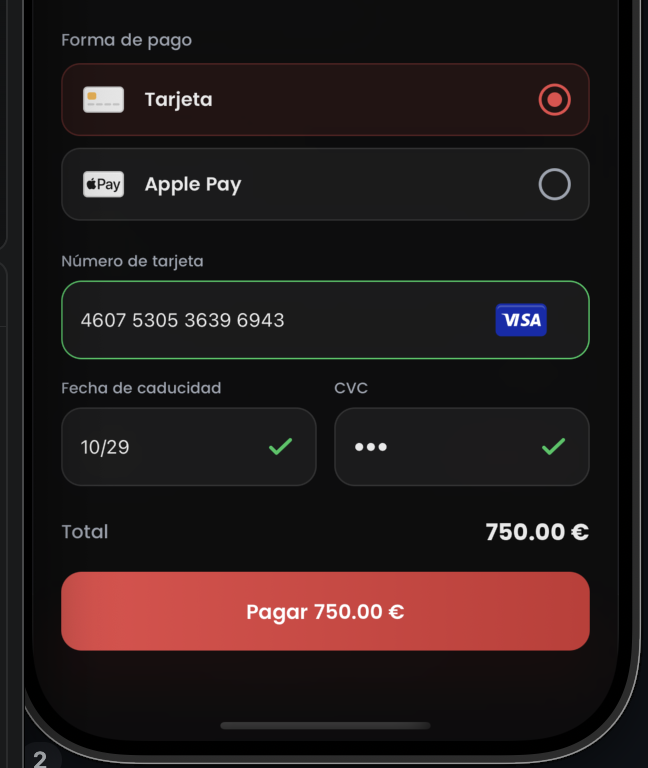

[](https://www.npmjs.com/package/react-native-native-card-form)


Hey! 👋 This is a small, cozy React Native card form whose PAN, expiry and CVC
inputs stay tucked away in private iOS/Android primitives — never in JavaScript.
React owns the layout, the labels, the errors and the logos; JS only ever gets
handed back sanitized validity/focus state and a PaymentMethod ID.

> **Security boundary, not PCI certification.** Keeping card values out of the
> React Native bridge does not by itself make an integration PCI compliant or
> eligible for SAQ A. Obtain an assessment for the complete host application.
> Screenshots and app-switcher previews are the host's responsibility.



NativeCardForm features:

- 🔒 PAN, expiry and CVC never cross the React Native bridge — only sanitized
  state and a `paymentMethodId` do
- 💳 Visa, Mastercard, Amex, Discover, JCB and UnionPay detection,
  Luhn-validated, with `unknown` for everything else
- ⌨️ Promise-based commands — `tokenize`, `focus`, `reset` — no prop counters,
  no resolver callbacks, one session per mounted form
- 🎨 Full appearance control: colors, fonts, weights, alignment and letter
  spacing, forwarded to the native inputs on both platforms
- ♿ 48pt/dp minimum touch target, Dynamic Type / font-scale aware, three
  accessibility elements with localized labels and live error regions
- 🌍 Fully localized — every label, hint and error comes from your own
  `NativeCardFormStrings`, with no native fallback copy
- 📋 Paste supported; copy, cut and sensitive state restoration are disabled
- 🧩 Expo Module for iOS 15.1+ and your host app's own Android `minSdk`
- ⚠️ A documented security **boundary**, not a PCI certification — see below

## Compatibility

| Dependency | Supported v0.x baseline |
| --- | --- |
| Expo | 54 (development build/CNG) |
| React Native | 0.81 |
| `@stripe/stripe-react-native` | 0.56 |
| iOS | 15.1+ |
| Android | the host application's `minSdk` |

Expo Go is not supported because this package contains native code. The clean
example's effective Android minSdk is 24; the library itself inherits the
consuming host's value. See
[`docs/COMPATIBILITY.md`](docs/COMPATIBILITY.md).

## Install

It's on npm! 🎉 Grab it together with its peer:

```sh
npm install react-native-native-card-form @stripe/stripe-react-native@0.56
npx expo prebuild
```

For Expo CNG, configure Stripe's plugin with an Apple merchant identifier (and
enable Google Pay only if the host has configured it):

```json
{
  "expo": {
    "plugins": [
      [
        "@stripe/stripe-react-native",
        {
          "merchantIdentifier": "merchant.com.example.app",
          "enableGooglePay": true
        }
      ]
    ]
  }
}
```

Bare React Native consumers use normal CocoaPods and Gradle autolinking.
The package does not bundle Stripe's native SDK; the Stripe React Native peer is
the single source of the compatible native version.

## Use

`StripeProvider` is required. The package does not accept a publishable-key prop.

```tsx
import { StripeProvider } from '@stripe/stripe-react-native';
import {
  NativeCardForm,
  type NativeCardFormRef,
} from 'react-native-native-card-form';

const ref = useRef<NativeCardFormRef>(null);

<StripeProvider publishableKey={publishableKey}>
  <NativeCardForm ref={ref} strings={strings} onChange={setState} />
</StripeProvider>;

const { paymentMethodId } = await ref.current!.tokenize();
```

Only Visa, Mastercard, Amex, Discover, JCB, UnionPay and `unknown` are
represented in v0.x. See [`docs/API.md`](docs/API.md) for commands, errors and
lifecycle.

The default wrapper includes accessible SVG marks for all six named networks.
Pass `renderBrand` to replace them. Layout uses normal flex flow: labels and
errors increase its intrinsic height, and no native coordinate event or fixed
form height is involved.

`appearance` customizes the React Native form/row/field/chrome/error styles and
the native text presentation. Text color, placeholder color, cursor color, font
family, size, weight, style, alignment and letter spacing are applied by the
native inputs on both platforms. Invalid native colors are surfaced as
configuration errors; they are never replaced silently.

### What JavaScript actually receives

Only this ever reaches props, events, state or results — never PAN, expiry,
CVC, partial values, card suffixes, Stripe parameters or raw Stripe errors:

| | |
| --- | --- |
| ✅ | `complete` |
| ✅ | `empty \| incomplete \| invalid \| valid`, `focused` and `touched`, per field |
| ✅ | `visa \| mastercard \| amex \| discover \| jcb \| unionpay \| unknown` |
| ✅ | a successful `paymentMethodId` |
| ✅ | a documented, closed error code |

See [`docs/API.md`](docs/API.md) for the full lifecycle and the closed error set.

## System policies

Paste is supported. Copy/cut and sensitive state restoration are disabled.
There is no internal font-scale cap. The host owns screenshot/app-switcher
protection, observability redaction, scrolling and any external font limits.
See [`docs/ACCESSIBILITY.md`](docs/ACCESSIBILITY.md) for the complete host/native
responsibility split.

## Docs

| | |
| --- | --- |
| [`docs/API.md`](docs/API.md) | Public API, appearance, data boundary, lifecycle and errors |
| [`docs/ACCESSIBILITY.md`](docs/ACCESSIBILITY.md) | Accessibility, localization and the host/native responsibility split |
| [`docs/VALIDATION.md`](docs/VALIDATION.md) | Number/brand/expiry/CVC rules and the editing spec — the cross-platform source of truth |
| [`docs/COMPATIBILITY.md`](docs/COMPATIBILITY.md) | Supported versions and the reproducible clean-example verification commands |
| [`docs/PUBLISHING.md`](docs/PUBLISHING.md) | Public repository export and the release runbook |

## Distribution

📦 Published on npm as
[`react-native-native-card-form`](https://www.npmjs.com/package/react-native-native-card-form).
It's still a pre-release alpha, so the API may keep settling a little before
v1 — pin a version if that matters to you. See
[`docs/PUBLISHING.md`](docs/PUBLISHING.md) for the release runbook.

## License

[MIT](LICENSE) © Guillermo Pérez ([gperez-eth](https://github.com/gperez-eth))

Thanks for reading this far — hope it's useful to you! 💙
